# Diagrams

Rendered in any Mermaid-compatible viewer (GitHub, VSCode Mermaid plugin,
Mermaid Live Editor). All diagrams are embedded in the associated section docs;
this file collects the canonical set.

## 1. System Context (section 02)

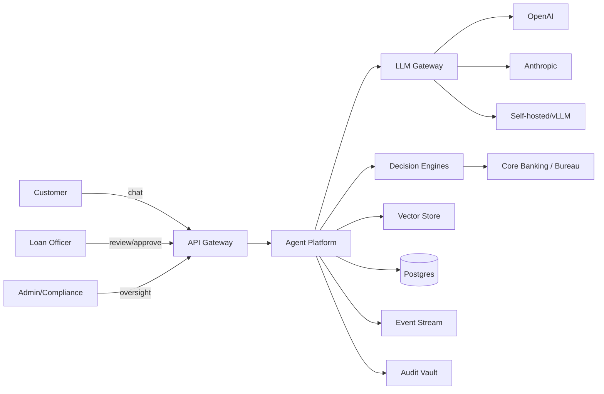

## 2. Agent Architecture (section 01)

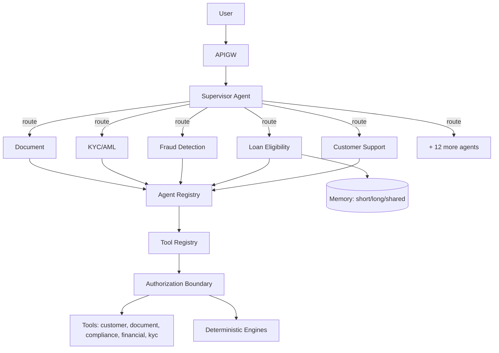

## 3. Agent Lifecycle (section 01)

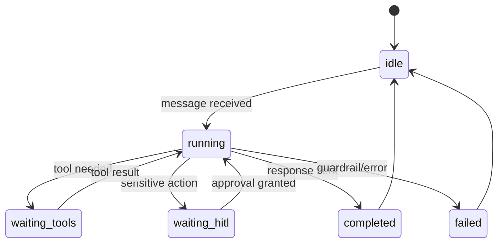

## 4. Security Trust Boundary (section 02)

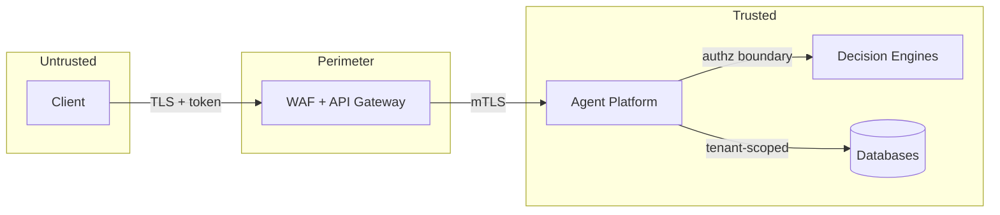

## 5. RAG Pipeline (section 09)

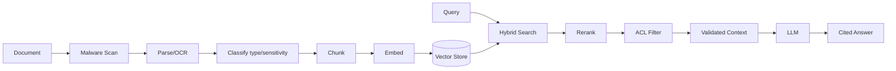

## 6. Loan Decision Flow (section 10 / 20)

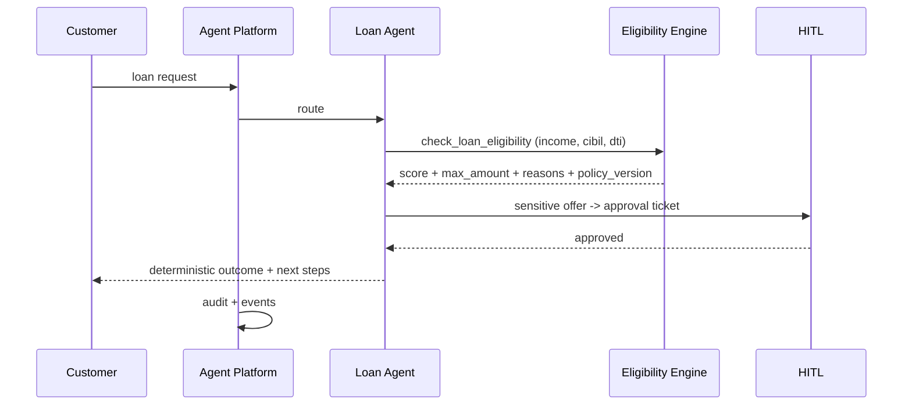

## 7. Multi-Tenancy (section 15)

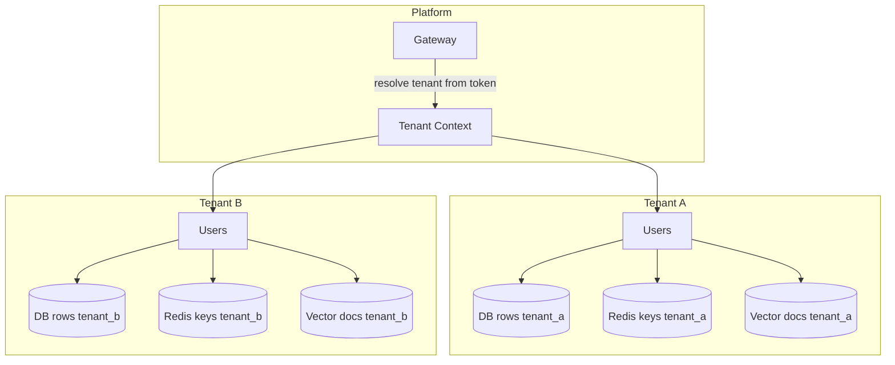

## 8. Event Architecture (section 12)

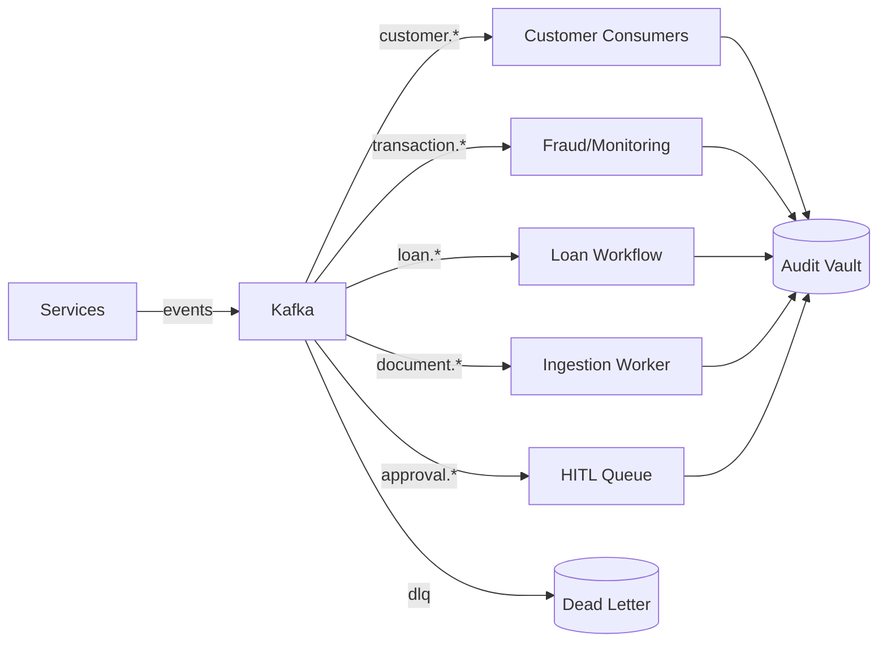

## 9. Observability (section 13)

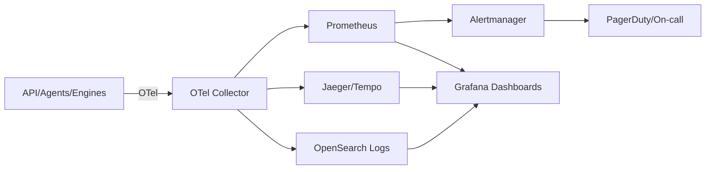

## 10. Deployment Topology (section 14)

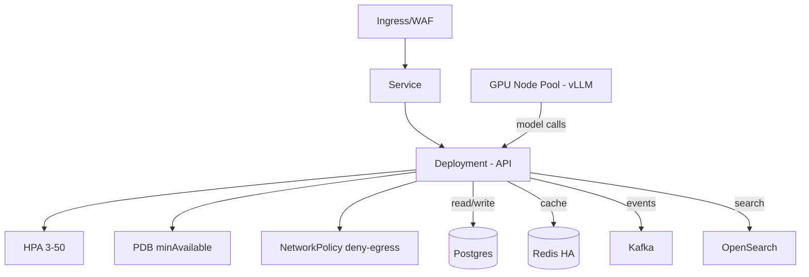

## 11. Multi-Region DR (section 07)

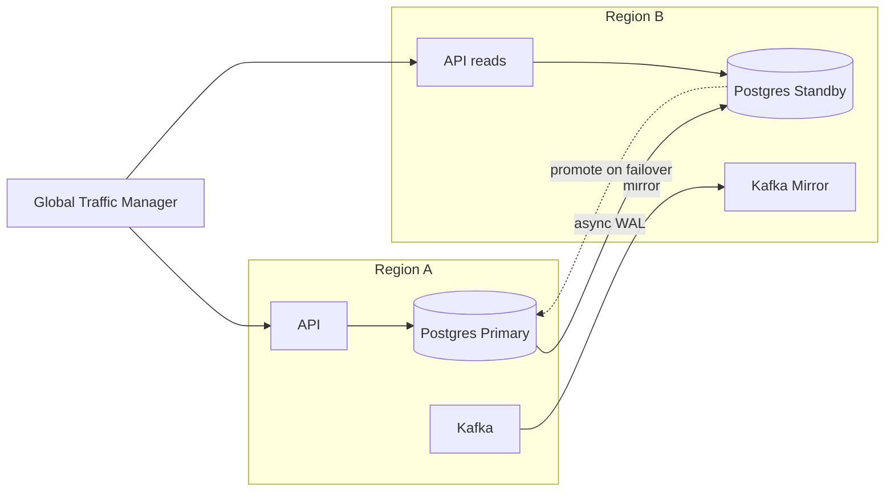

## 12. CI/CD Pipeline (section 14)

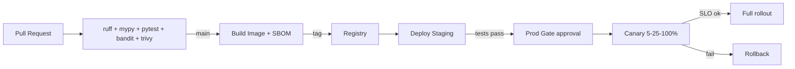

## 13. Fraud Decisioning (section 10)

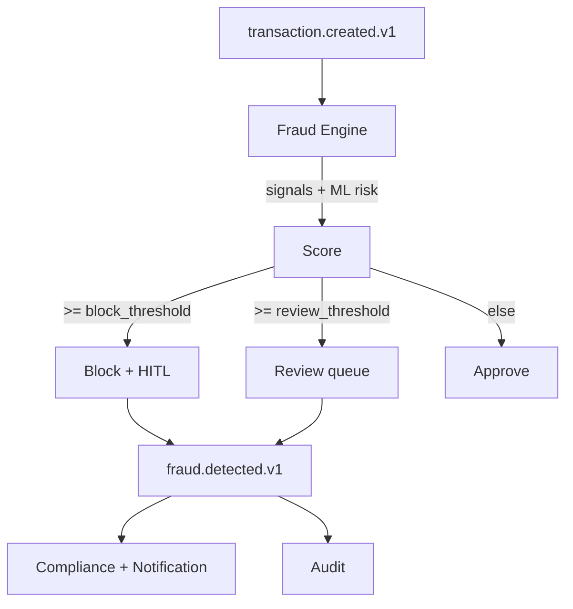

## 14. LLM Gateway Routing (section 08)

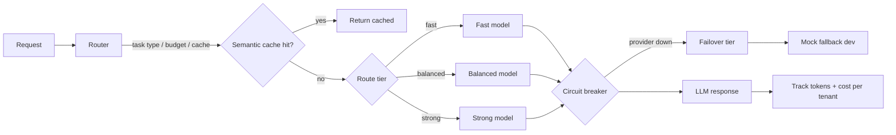

## 15. Compliance Evidence (section 03)

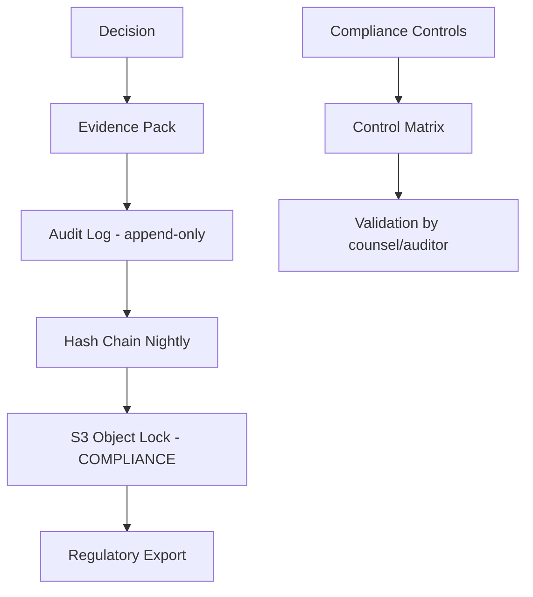

## 16. HITL Approval (section 20)

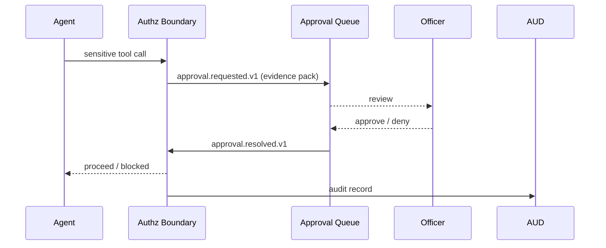